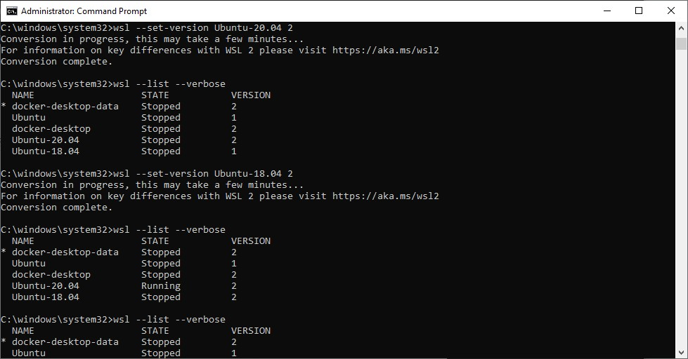
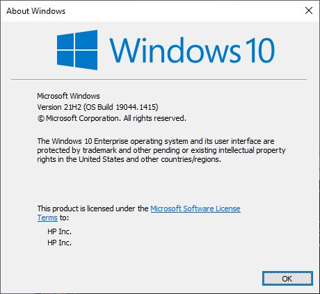
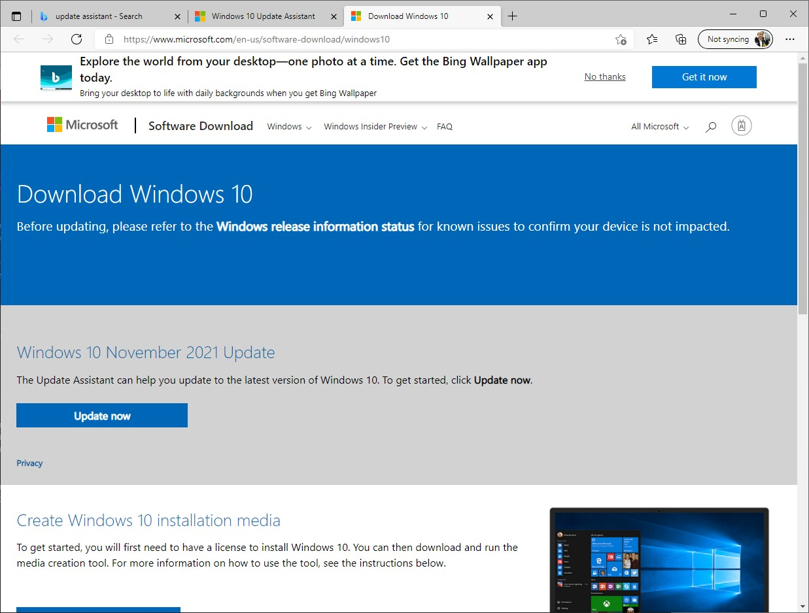

# gpu-in-docker
* [blog 1](https://blog.roboflow.com/use-the-gpu-in-docker/)
* [blog 2](https://towardsdatascience.com/how-to-properly-use-the-gpu-within-a-docker-container-4c699c78c6d1)
* [WSL 2](https://docs.nvidia.com/cuda/wsl-user-guide/index.html)
* [nvidia-container-toolkit](https://docs.nvidia.com/datacenter/cloud-native/container-toolkit/install-guide.html#docker)
* [nvidia-docker](https://github.com/NVIDIA/nvidia-docker)
* [nvidia-container-runtime](https://github.com/NVIDIA/nvidia-container-runtime/)
* [Set to WSL 2](https://pureinfotech.com/install-windows-subsystem-linux-2-windows-10/)
* [Azure GPU containers](https://docs.microsoft.com/en-us/azure/container-instances/container-instances-gpu)
* [StackOverflow WSL 2](https://stackoverflow.com/questions/70011494/why-does-nvidia-smi-return-gpu-access-blocked-by-the-operating-system-in-wsl2)
* [CUDA WSL Download](https://developer.nvidia.com/cuda/wsl/download)
* [amazon-eks-ami](https://github.com/awslabs/amazon-eks-ami)

## 1. Use WSL 2 and Win10 21H2
The `nvidia-container-runtime` only work on linux. The linux distro on Win10 should use WSL 2.
* Open the _Command Prompt_ as Administrator:
```cmd
C:\windows\system32>wsl --list --verbose
C:\windows\system32>wsl --set-version Ubuntu-20.04 2
```


It only work starting with Win10 November 2021 Release (21H2). Press `Win-R` and type in _winver_:


If it's older, update it with _Update Assistant_:


## 2. Install Docker-CE on WSL 2
```sh
$ curl https://get.docker.com | sh
```

## 3. Install NVidia Container Toolkit
```sh
$ distribution=$(. /etc/os-release;echo $ID$VERSION_ID)
$ curl -s -L https://nvidia.github.io/nvidia-docker/gpgkey | sudo apt-key add -
$ curl -s -L https://nvidia.github.io/nvidia-docker/$distribution/nvidia-docker.list | sudo tee /etc/apt/sources.list.d/nvidia-docker.list

$ sudo apt-get update
$ sudo apt-get install -y nvidia-docker2
$ sudo apt install nvidia-cuda-toolkit

$ sudo service docker stop
$ sudo service docker start
$ sudo service docker status

# Test dockerd
$ sudo dockerd
```

## 2. Check GPU
```sh
$ nvcc --version
nvcc: NVIDIA (R) Cuda compiler driver
Copyright (c) 2005-2019 NVIDIA Corporation
Built on Sun_Jul_28_19:07:16_PDT_2019
Cuda compilation tools, release 10.1, V10.1.243

$ nvidia-smi
Wed Dec 15 10:01:22 2021
+-----------------------------------------------------------------------------+
| NVIDIA-SMI 470.83       Driver Version: 472.42       CUDA Version: 11.4     |
|-------------------------------+----------------------+----------------------+
| GPU  Name        Persistence-M| Bus-Id        Disp.A | Volatile Uncorr. ECC |
| Fan  Temp  Perf  Pwr:Usage/Cap|         Memory-Usage | GPU-Util  Compute M. |
|                               |                      |               MIG M. |
|===============================+======================+======================|
|   0  NVIDIA RTX A200...  Off  | 00000000:01:00.0 Off |                  N/A |
| N/A    0C    P0    14W /  N/A |    106MiB /  4096MiB |    ERR!      Default |
|                               |                      |                  N/A |
+-------------------------------+----------------------+----------------------+

+-----------------------------------------------------------------------------+
| Processes:                                                                  |
|  GPU   GI   CI        PID   Type   Process name                  GPU Memory |
|        ID   ID                                                   Usage      |
|=============================================================================|
|  No running processes found                                                 |
+-----------------------------------------------------------------------------+
```

## 3. use the NVIDIA Container Toolkit
```sh
$ vi Dockerfile
$ sudo docker build . -t nvidia-test
$ sudo docker run --rm -it --gpus all nvidia-test
Wed Dec 15 18:04:46 2021
+-----------------------------------------------------------------------------+
| NVIDIA-SMI 470.83       Driver Version: 472.42       CUDA Version: 11.4     |
|-------------------------------+----------------------+----------------------+
| GPU  Name        Persistence-M| Bus-Id        Disp.A | Volatile Uncorr. ECC |
| Fan  Temp  Perf  Pwr:Usage/Cap|         Memory-Usage | GPU-Util  Compute M. |
|                               |                      |               MIG M. |
|===============================+======================+======================|
|   0  NVIDIA RTX A200...  Off  | 00000000:01:00.0 Off |                  N/A |
| N/A    0C    P0    12W /  N/A |    106MiB /  4096MiB |    ERR!      Default |
|                               |                      |                  N/A |
+-------------------------------+----------------------+----------------------+

+-----------------------------------------------------------------------------+
| Processes:                                                                  |
|  GPU   GI   CI        PID   Type   Process name                  GPU Memory |
|        ID   ID                                                   Usage      |
|=============================================================================|
|  No running processes found                                                 |
+-----------------------------------------------------------------------------+

$ sudo docker run --gpus all nvcr.io/nvidia/k8s/cuda-sample:nbody nbody -gpu -benchmark
$ sudo docker run --rm --gpus all -it --shm-size=1g --ulimit memlock=-1 --ulimit stack=67108864 nvcr.io/nvidia/tensorflow:20.03-tf2-py3

================
== TensorFlow ==
================

NVIDIA Release 20.03-tf2 (build 11026100)
TensorFlow Version 2.1.0

Container image Copyright (c) 2019, NVIDIA CORPORATION.  All rights reserved.
Copyright 2017-2019 The TensorFlow Authors.  All rights reserved.

Various files include modifications (c) NVIDIA CORPORATION.  All rights reserved.
NVIDIA modifications are covered by the license terms that apply to the underlying project or file.

WARNING: The NVIDIA Driver was not detected.  GPU functionality will not be available.
   Use 'nvidia-docker run' to start this container; see
   https://github.com/NVIDIA/nvidia-docker/wiki/nvidia-docker .

NOTE: MOFED driver for multi-node communication was not detected.
      Multi-node communication performance may be reduced.

root@bf54a887942b:/workspace# exit
exit

$ sudo docker run --rm -it --gpus all --env NVIDIA_DISABLE_REQUIRE=1 nvcr.io/nvidia/k8s/cuda-sample:nbody nbody -gpu -benchmark
Run "nbody -benchmark [-numbodies=<numBodies>]" to measure performance.
        -fullscreen       (run n-body simulation in fullscreen mode)
        -fp64             (use double precision floating point values for simulation)
        -hostmem          (stores simulation data in host memory)
        -benchmark        (run benchmark to measure performance)
        -numbodies=<N>    (number of bodies (>= 1) to run in simulation)
        -device=<d>       (where d=0,1,2.... for the CUDA device to use)
        -numdevices=<i>   (where i=(number of CUDA devices > 0) to use for simulation)
        -compare          (compares simulation results running once on the default GPU and once on the CPU)
        -cpu              (run n-body simulation on the CPU)
        -tipsy=<file.bin> (load a tipsy model file for simulation)

NOTE: The CUDA Samples are not meant for performance measurements. Results may vary when GPU Boost is enabled.

> Windowed mode
> Simulation data stored in video memory
> Single precision floating point simulation
> 1 Devices used for simulation
GPU Device 0: "Ampere" with compute capability 8.6

> Compute 8.6 CUDA device: [NVIDIA RTX A2000 Laptop GPU]
20480 bodies, total time for 10 iterations: 21.712 ms
= 193.180 billion interactions per second
= 3863.604 single-precision GFLOP/s at 20 flops per interaction
```

the `Dockerfile`
```dockerfile
FROM nvidia/cuda:10.2-base
CMD nvidia-smi
```

## Notes
```
================================================================================

To run Docker as a non-privileged user, consider setting up the
Docker daemon in rootless mode for your user:

    dockerd-rootless-setuptool.sh install

Visit https://docs.docker.com/go/rootless/ to learn about rootless mode.


To run the Docker daemon as a fully privileged service, but granting non-root
users access, refer to https://docs.docker.com/go/daemon-access/

WARNING: Access to the remote API on a privileged Docker daemon is equivalent
         to root access on the host. Refer to the 'Docker daemon attack surface'
         documentation for details: https://docs.docker.com/go/attack-surface/

================================================================================
```
